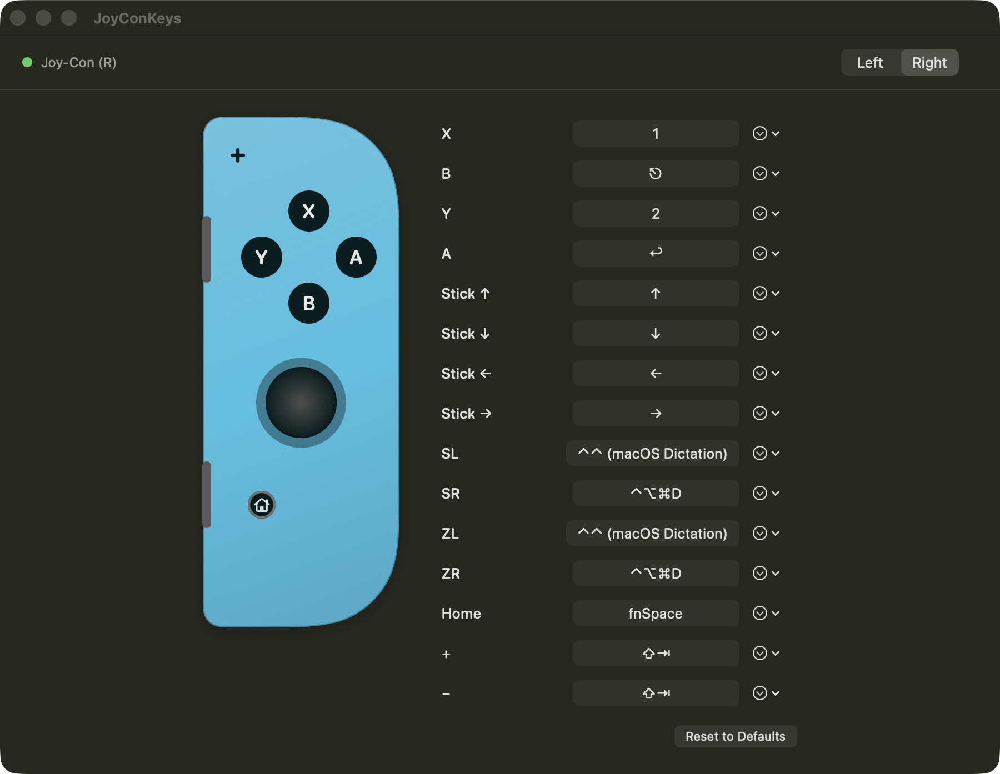

# JoyConKeys

Turn a Nintendo Switch Joy-Con into a macOS remote control — for dictation,
Claude Code menus, or any keyboard-driven workflow.

A tiny menu-bar app, pure Swift, zero dependencies. It shows a live drawing
of your Joy-Con; click any button on it (or in the list), press a keyboard
combo, and the mapping applies instantly.



## Features

- **Live visualization** — neon-red (L) / neon-blue (R) Joy-Con rendered in
  vector; buttons light up as you press them, the stick cap moves.
- **Click-to-record mapping** — click a button, press `⌃⌥⌘D` (or anything),
  done. Mappings persist in
  `~/Library/Application Support/JoyConKeys/mappings.json` and apply live.
- **Vertical grip** — the stick is remapped for holding the Joy-Con upright
  (as when docked on the console), not sideways. Up is toward the X button.
- **Auto-repeat** — hold the stick to repeat arrows, keyboard-style
  (400 ms delay, then 120 ms interval), with hysteresis so it never jitters.
- **Special actions** — a button can double-tap Control (the macOS dictation
  shortcut) instead of a plain combo.
- **Never-combined policy** — every Joy-Con is treated as an independent
  little remote with mirrored mappings. If macOS merges two into a combined
  "Joy-Con (L/R)" (it does this automatically and it can't be prevented),
  the app absorbs it: the left half's arrow buttons fire the face-button
  actions by position, and both sticks act as the stick. Swap controllers
  whenever one is charging — behavior is identical.

## Default mapping

| Input | Sends | Meant for |
|---|---|---|
| Stick (vertical grip) | ↑ ↓ ← → | Menu navigation, auto-repeats |
| A | Return | Confirm |
| B | Escape | Cancel / interrupt |
| X / Y | `1` / `2` | Pick option 1 / 2 directly |
| SL (or ZL paired) | double-Control | macOS dictation |
| SR (or ZR paired) | ⌃⌥⌘D | Codex dictation toggle |
| Home / Capture | double-Control | macOS dictation |
| + / − | ⇧⇥ | Claude Code mode switch |

## Install

Requires macOS 15+ and a Swift 6 toolchain (Xcode **or** just the Command
Line Tools — no Xcode project involved).

```sh
git clone https://github.com/xiaosongz/joycon-keys.git && cd joycon-keys
scripts/build-app.sh          # → dist/JoyConKeys.app (ad-hoc signed)
cp -R dist/JoyConKeys.app /Applications/
open /Applications/JoyConKeys.app
```

Then:

1. Pair the Joy-Con: hold its round sync button until the LEDs sweep, then
   connect in System Settings › Bluetooth.
2. Grant **Accessibility** permission when prompted (System Settings ›
   Privacy & Security › Accessibility) — required for synthesizing key
   events. Nothing works without it, and macOS drops the events *silently*.
3. Click the gamecontroller icon in the menu bar → **Open Mapping Editor**.

### Start at login

Easiest: flip **Start at login** in the app's ⚙ Settings tab (a standard
macOS login item). The same tab has **Start minimized** — on by default;
turn it off to open the mapping editor on launch.

Login items are keyed to the code-signing identity, same as the
Accessibility grant below: with the default ad-hoc signing, each rebuild
orphans the previous entry. Sign with a persistent certificate if you
rebuild often, and run the app from `/Applications` (the toggle refuses a
build-directory path on purpose).

Alternatively install a LaunchAgent (survives crashes via `KeepAlive` —
don't combine it with the login item, or two instances will race):

```sh
cp scripts/launchagent.plist ~/Library/LaunchAgents/com.xiaosong.joycon-keys.plist
launchctl bootstrap "gui/$(id -u)" ~/Library/LaunchAgents/com.xiaosong.joycon-keys.plist
```

launchd refuses to exec binaries on external volumes — keep the app on the
boot disk.

The agent logs to `/tmp/joycon-keys.log` (the maintainer's `deploy.sh`
repoints it to `~/Library/Logs/joycon-keys.log`). Check it first when keys
don't arrive: the startup line `accessibility trusted: yes/NO` is the only
visible symptom of a missing permission, because macOS drops synthetic
events silently.

### Raw HID engine (SL/SR everywhere, no combine/split gesture)

The ⚙ Settings tab has an **Always use raw HID** toggle (off by default).
When on, the app bypasses Apple's GameController framework and reads both
Joy-Con Bluetooth HID devices directly via IOKit.

Why it exists: when macOS merges two Joy-Cons into one combined controller,
the GameController framework stops reporting SL/SR entirely
([SDL #6095](https://github.com/libsdl-org/SDL/issues/6095)) — and a single
Joy-Con reports *only* SL/SR. The raw engine sees every button on every
half in every mode, so SL/SR always work and the Capture+Home combine/split
gesture becomes unnecessary — dock one half for charging and keep playing
on the other, no ritual.

The toggle needs **Input Monitoring** permission (System Settings › Privacy
& Security › Input Monitoring) — separate from the Accessibility grant, and
keyed to the same code-signing identity caveats below. If the permission is
missing, the app falls back to the GameController engine and the Settings
tab shows a red caption with a grant button. Flipping the toggle takes
effect immediately; no relaunch needed. Stick calibration is read from the
Joy-Con's own factory/user calibration stored in its SPI flash, so stick
feel matches the system engine.

### Re-building without losing the Accessibility grant

macOS keys the permission to the app's code-signing identity. Ad-hoc signing
(the default) changes identity every build, so the grant dies each time —
you must *delete* the stale entry (−) in System Settings and re-add;
re-toggling does nothing. To keep the grant across rebuilds, sign with any
persistent certificate (a free self-signed "code signing" cert in Keychain
Access works) and keep the bundle identifier stable:

```sh
SIGN_IDENTITY=my-cert-name scripts/build-app.sh
```

## Quirks worth knowing (learned the hard way)

- **A single Joy-Con exposes no `extendedGamepad` profile on macOS** — only
  `physicalInputProfile`, and it reports **only SL/SR** (as Left/Right
  Shoulder). R and ZR are never reported standalone; a combined pair reports
  R/ZR but loses SL/SR ([SDL #6095](https://github.com/libsdl-org/SDL/issues/6095)).
- **macOS reports single-Joy-Con stick axes in the sideways-grip frame.**
  This app rotates them per side for vertical grip: (R) up = +x, (L) up = −x.
- **Fn cannot be sent as a flag on a key event** — it latches system-wide.
  It needs explicit `flagsChanged` events (vk 63) with the flag cleared on
  release. Combos here press real modifier keys in order and release in
  reverse, like fingers.
- **If Steam is running** (even in the background) it grabs the Home/guide
  button globally and brings itself forward. That's Steam, not this app —
  disable it in Steam → Settings → Controller, or quit Steam.
- **Joy-Con battery level is not exposed** by macOS (`GCController.battery`
  is nil). Dock it on the console to check charge.
- **Headless screenshots**: `JoyConKeys --render-preview /tmp/out` writes
  `out-window.png` and `out-pair.png` and exits — how the image above is
  generated.

## License

MIT — see [LICENSE](LICENSE).

Not affiliated with or endorsed by Nintendo. Nintendo Switch and Joy-Con
are trademarks of Nintendo.
