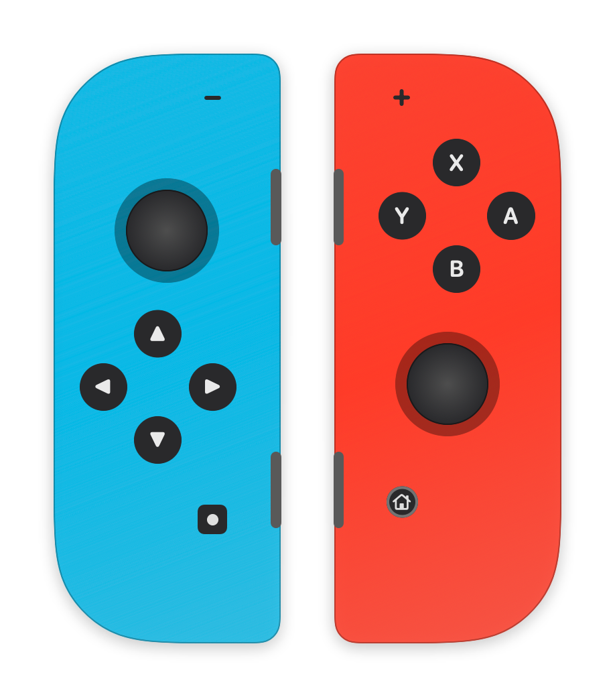

# JoyConKeys

Turn a Nintendo Switch Joy-Con into a macOS remote control — for dictation,
Claude Code menus, or any keyboard-driven workflow.

A tiny menu-bar app, pure Swift, zero dependencies. It shows a live drawing
of your Joy-Con; click any button on it (or in the list), press a keyboard
combo, and the mapping applies instantly.



## Features

- **Live visualization** — neon-blue (L) / neon-red (R) Joy-Con rendered in
  vector; buttons light up as you press them, the stick cap moves.
- **Click-to-record mapping** — click a button, press `⌃⌥⌘D` (or anything),
  done. Mappings persist in
  `~/Library/Application Support/JoyConKeys/mappings.json` and apply live.
- **Vertical grip** — the stick is remapped for holding the Joy-Con upright
  (as when docked on the console), not sideways. Up is toward the X button.
- **Auto-repeat** — hold the stick to repeat arrows, keyboard-style
  (400 ms delay, then 120 ms interval), with hysteresis so it never jitters.
- **Special actions** — a button can double-tap Control (the macOS dictation
  shortcut) instead of a plain combo.
- **Both grips covered** — a single Joy-Con and a combined (L)+(R) pair both
  work; SL/SR and ZL/ZR are mappable separately.

## Default mapping

| Input | Sends | Meant for |
|---|---|---|
| Stick (vertical grip) | ↑ ↓ ← → | Menu navigation, auto-repeats |
| A | Return | Confirm |
| B | Escape | Cancel / interrupt |
| X / Y | `1` / `2` | Pick option 1 / 2 directly |
| SL (or ZL paired) | double-Control | macOS dictation |
| SR (or ZR paired) | ⌃⌥⌘D | Codex dictation toggle |
| Home / Capture | double-Control | macOS dictation |
| + / − | ⇧⇥ | Claude Code mode switch |

## Install

Requires macOS 15+ and a Swift 6 toolchain (Xcode **or** just the Command
Line Tools — no Xcode project involved).

```sh
git clone <this repo> && cd joycon-keys
scripts/build-app.sh          # → dist/JoyConKeys.app
cp -R dist/JoyConKeys.app /Applications/
open /Applications/JoyConKeys.app
```

Then:

1. Pair the Joy-Con: hold its round sync button until the LEDs sweep, then
   connect in System Settings › Bluetooth.
2. Grant **Accessibility** permission when prompted (System Settings ›
   Privacy & Security › Accessibility) — required for synthesizing key
   events. Nothing works without it, and macOS drops the events *silently*.
3. Click the gamecontroller icon in the menu bar → **Open Mapping Editor**.

### Start at login

Either add the app in System Settings › General › Login Items, or install a
LaunchAgent (survives crashes via `KeepAlive`):

```sh
cp scripts/launchagent.plist ~/Library/LaunchAgents/com.xiaosong.joycon-keys.plist
# edit the executable path inside, then:
launchctl bootstrap "gui/$(id -u)" ~/Library/LaunchAgents/com.xiaosong.joycon-keys.plist
```

launchd refuses to exec binaries on external volumes — keep the app on the
boot disk.

### Re-building without losing the Accessibility grant

macOS keys the permission to the app's code-signing identity. Ad-hoc signing
(`SIGN_IDENTITY=-`) changes identity every build, so the grant dies each
time — you must *delete* the stale entry (−) in System Settings and re-add;
re-toggling does nothing. To keep the grant across rebuilds, sign with any
persistent certificate (a free self-signed "code signing" cert in Keychain
Access works) and keep the bundle identifier stable:

```sh
SIGN_IDENTITY=my-cert-name scripts/build-app.sh
```

## Quirks worth knowing (learned the hard way)

- **A single Joy-Con exposes no `extendedGamepad` profile on macOS** — only
  `physicalInputProfile`, and it reports **only SL/SR** (as Left/Right
  Shoulder). R and ZR are never reported standalone; a combined pair reports
  R/ZR but loses SL/SR ([SDL #6095](https://github.com/libsdl-org/SDL/issues/6095)).
- **macOS reports single-Joy-Con stick axes in the sideways-grip frame.**
  This app rotates them per side for vertical grip: (R) up = +x, (L) up = −x.
- **Fn cannot be sent as a flag on a key event** — it latches system-wide.
  It needs explicit `flagsChanged` events (vk 63) with the flag cleared on
  release. Combos here press real modifier keys in order and release in
  reverse, like fingers.
- **If Steam is running** (even in the background) it grabs the Home/guide
  button globally and brings itself forward. That's Steam, not this app —
  disable it in Steam → Settings → Controller, or quit Steam.
- **Joy-Con battery level is not exposed** by macOS (`GCController.battery`
  is nil). Dock it on the console to check charge.

## License

MIT — see [LICENSE](LICENSE).
